# foodmate
**Foodmate** is a meal planning and recipe browsing web app that helps users discover recipes based on their preferences, dietary needs, and available ingredients. Built with Node.js, MongoDB, and Materialize CSS, it supports JWT authentication and third-party API integration (Spoonacular, Google Gemini).

## Features

- User Authentication with Email Verification  
- Recipe Search with Dietary & Allergen Filters  
- Personalized Meal Plans  
- Caching for optimized API usage  
- Modern responsive UI using Materialize CSS  
- Integration with Spoonacular API (for recipes)

## Tech Stack

- **Backend**: Node.js, Express.js  
- **Frontend**: EJS templates, Materialize CSS  
- **Database**: MongoDB  
- **Authentication**: JWT, Email verification  
- **Logging**: Winston – centralized logging for debugging and error tracking

- **API Integrations**:  
  - **Spoonacular** – for recipe data  
  - **Google Gemini** – AI-powered meal chat responses (via Socket.io)  
  - **Mailtrap** – for email testing and verification  

- **Real-time Communication**:  
  - **Socket.io** – enables live chat interactions with the AI

## RESTful API Endpoints

### Auth Routes (`/auth`)

| Method | Endpoint     | Description                          | Auth Required |
|--------|--------------|--------------------------------------|---------------|
| POST   | `/login`     | Logs in a user and returns a token   | ❌            |
| GET    | `/logout`    | Logs out user, clears token cookie   | ✅            |
| GET    | `/verify`    | Verifies user email                  | ❌            |
| GET    | `/register`  | Renders registration page            | ❌            |
| POST   | `/register`  | Registers a new user                 | ❌            |

### Recipe Routes (`/recipe`)

| Method | Endpoint     | Description                            | Auth Required |
|--------|--------------|----------------------------------------|---------------|
| GET    | `/search`    | Searches for recipes (filtered)        | ✅            |
| GET    | `/`          | Returns saved or suggested recipes     | ✅            |

##  Socket Events

| Event Name   | Direction | Description                                                 |
|--------------|-----------|-------------------------------------------------------------|
| `ai-message` | Client → Server | Sent by the client when a user submits a chat message to the AI |
| `ai-reply`   | Server → Client | Emitted by the server with the AI's response (from Gemini)         |


## Running Locally

1. Clone the repository  
   ```bash
   git clone https://github.com/apriilbee/foodmate.git
   cd foodmate
   ```

2. Install dependencies
    ```
    npm install
    ```
3. Setup `.env` file. Replace with actual values. 
    ```
    # Spoonacular API Key
    SPOONACULAR_KEY=your-api-key

    # MongoDB Connection URI (e.g., mongodb+srv://...)
    MONGO_URI=mongodb://localhost:27017/foodmate

    # JWT Secrets
    JWT_SECRET=your-jwt-secret
    JWT_REFRESH_SECRET=your-jwt-refresh-secret

    # Gemini AI API Key
    GEMINI_API_KEY=your-gemini-api-key

    # Base URL of the application (for cookies, redirects, etc.)
    BASE_URL=http://localhost:3000

    # Mailtrap SMTP Config (for email testing in development)
    MAILTRAP_HOST=sandbox.smtp.mailtrap.io
    MAILTRAP_PORT=2525
    MAILTRAP_USER=your-mailtrap-username
    MAILTRAP_PASS=your-mailtrap-password
    ```
4.  Run the app.
    If you're actively developing: 
    ```
    npm run dev 
    ```
    
    If you're running app in production mode: 
    ```
    npm start 
    ```

## Screenshots
### User Authentication
<table>
  <tr>
    <td align="center">
      
    </td>
    <td align="center">
      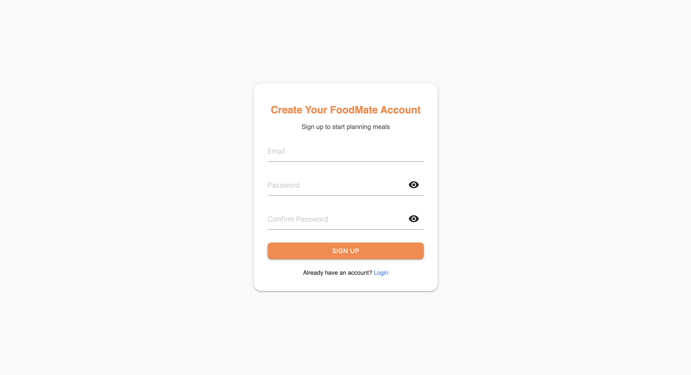
    </td>
  </tr>
</table>

### Recipe Filtering
<table>
  <tr>
    <td align="center">
      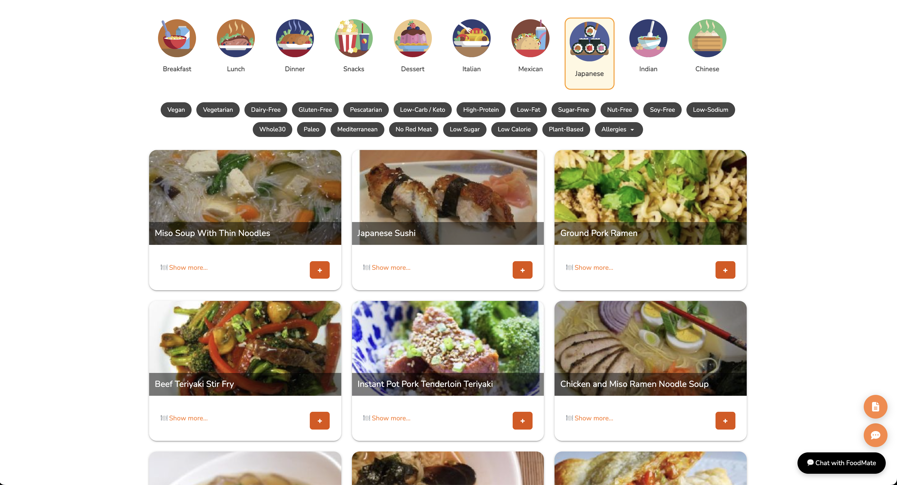
    </td>
    <td align="center">
      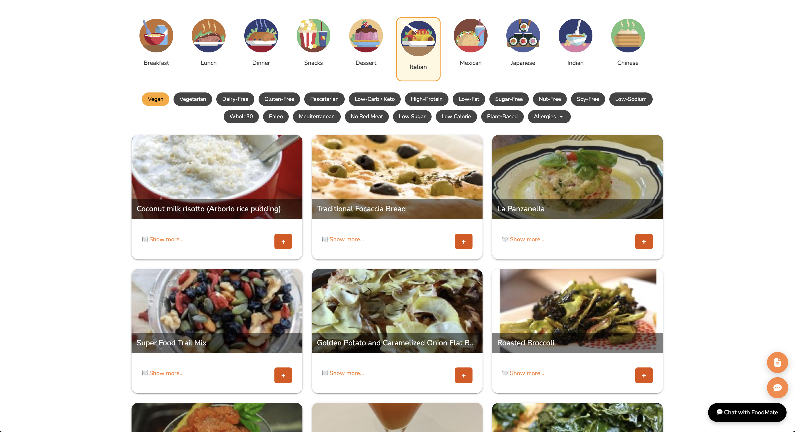
    </td>
  </tr>
</table>


### Recipe Search
<table>
  <tr>
    <td align="center">
      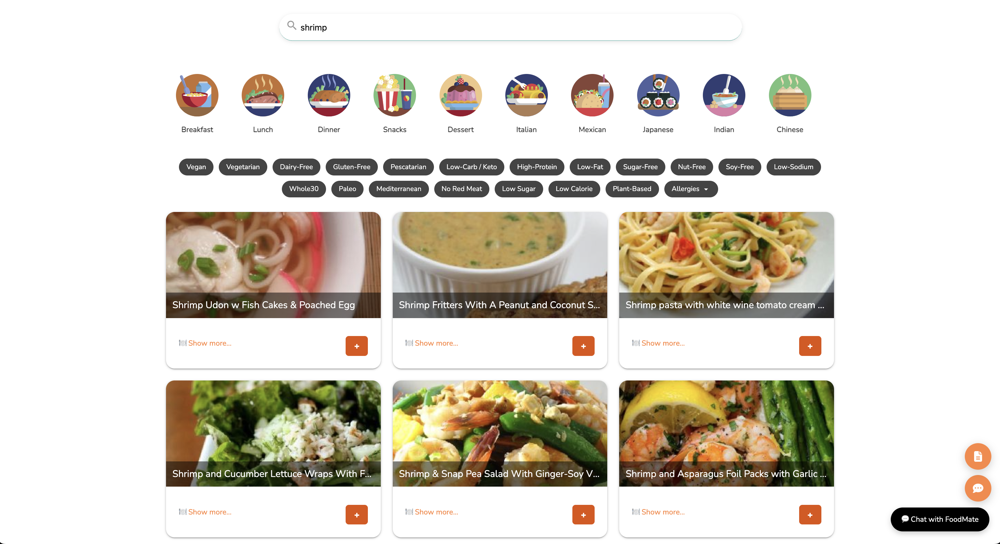
    </td>
  </tr>
</table>

### Real-time Chat
<table>
  <tr>
    <td align="center">
      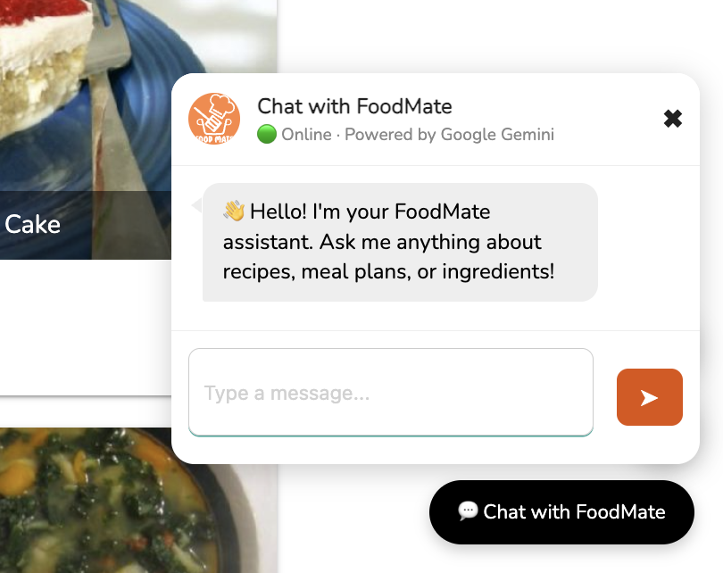
    </td>
    <td align="center">
      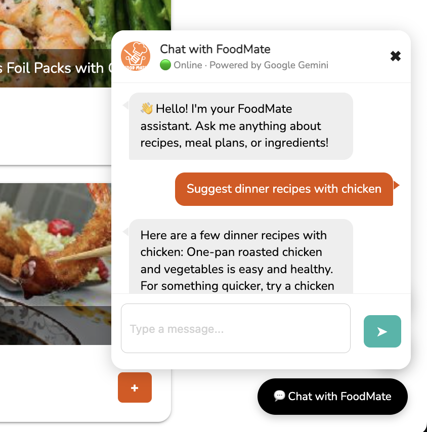
    </td>
  </tr>
</table>

### Update Profile Setting

<table>
  <tr>
    <td align="center">
      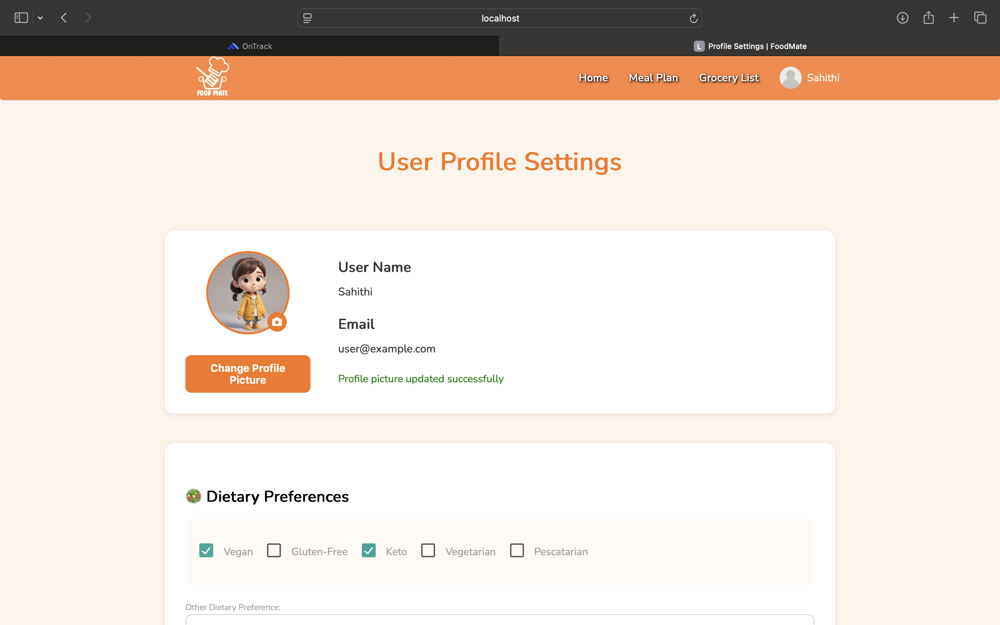
    </td>
    <td align="center">
      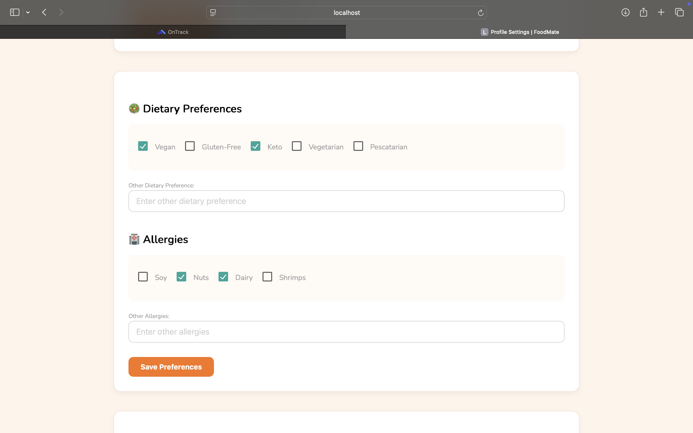
    </td>
  </tr>
  <tr>
    <td align="center">
      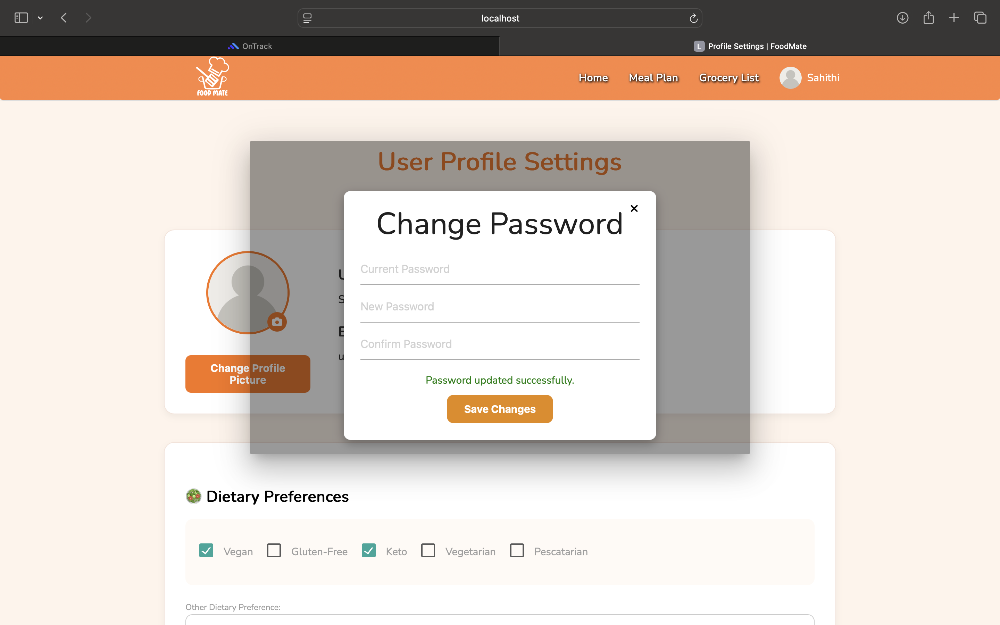
    </td>
    <td align="center">
      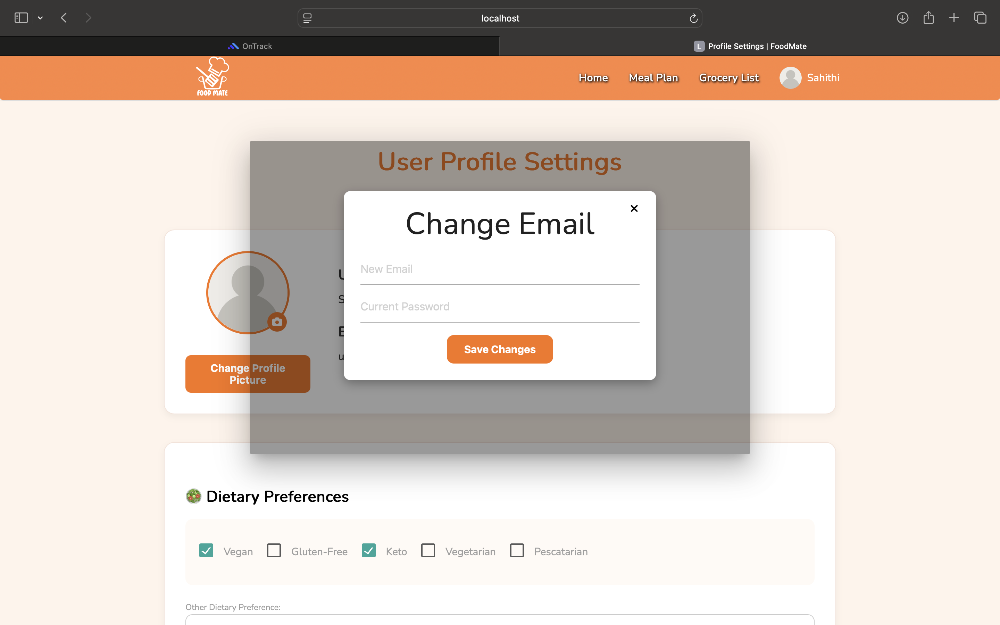
    </td>
    <td align="center">
      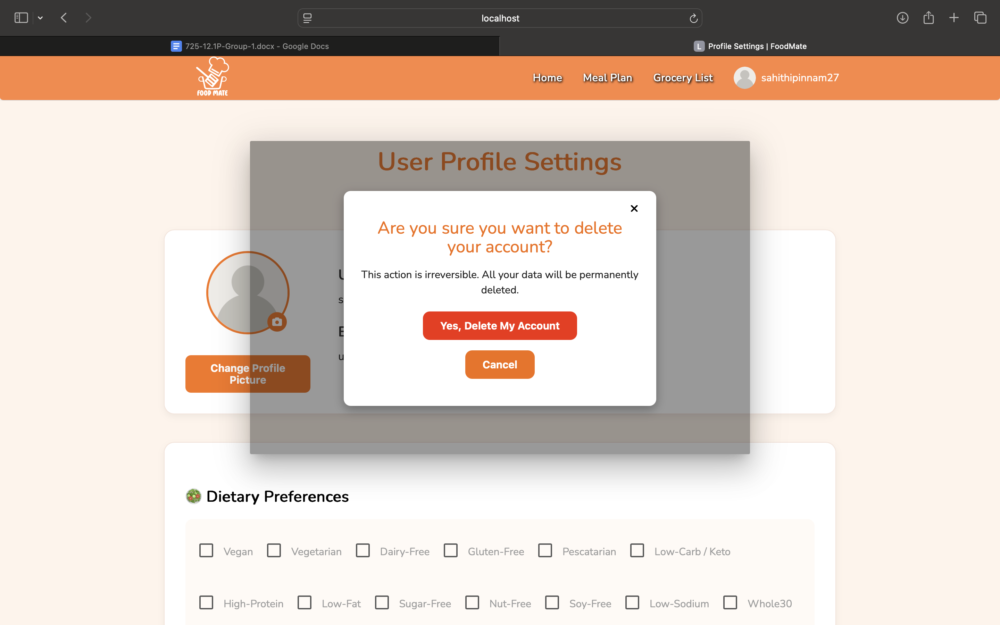
    </td>
  </tr>
</table>

### Grocery List Generation

<table>
  <tr>
    <td align="center">
      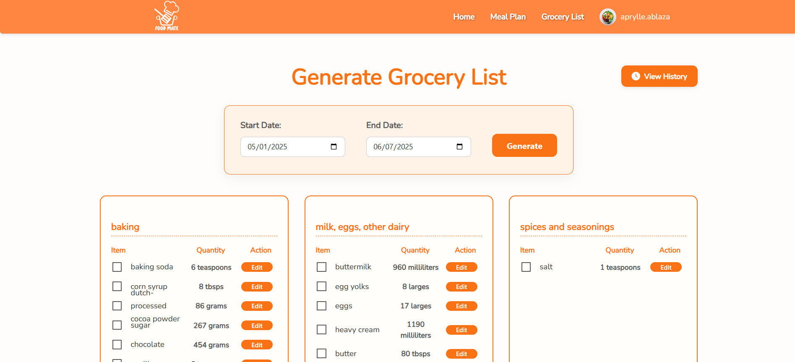
    </td>
  </tr>
  <tr>
    <td align="center">
      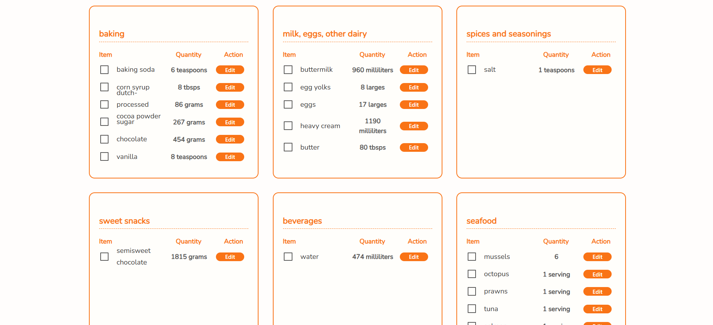
    </td>
  </tr>
</table>

