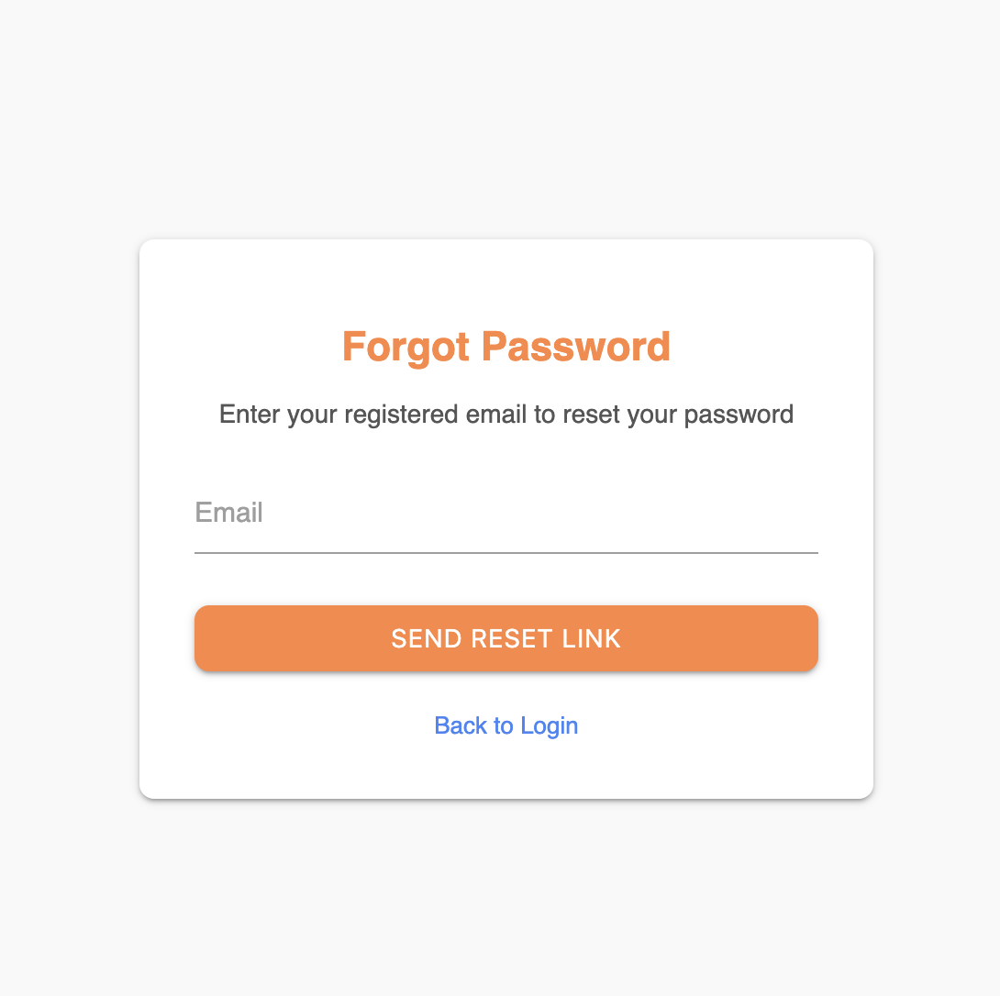
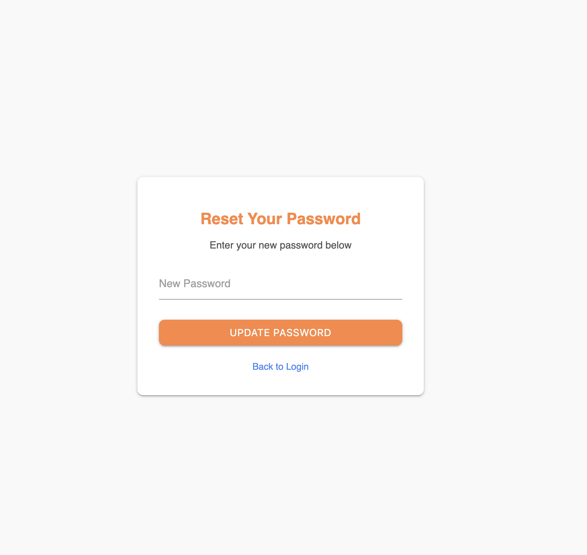
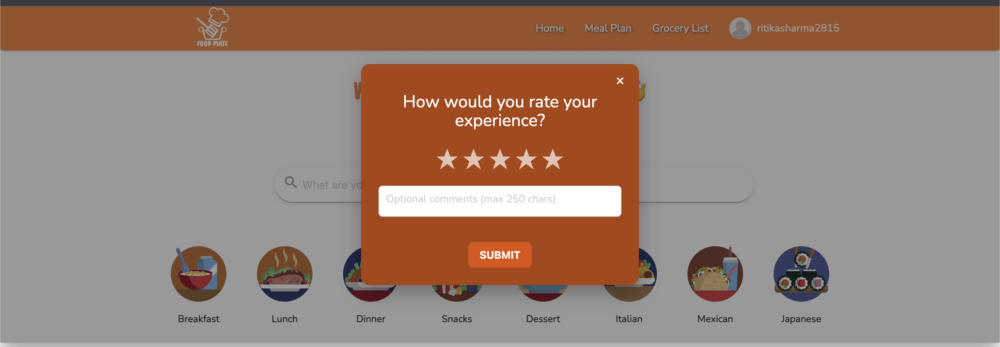
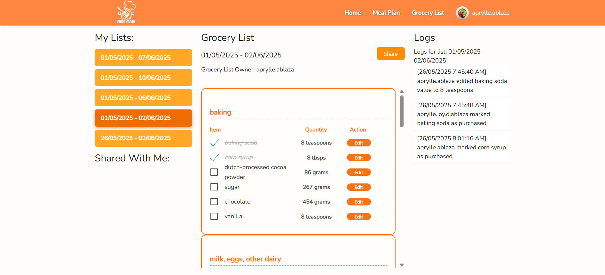
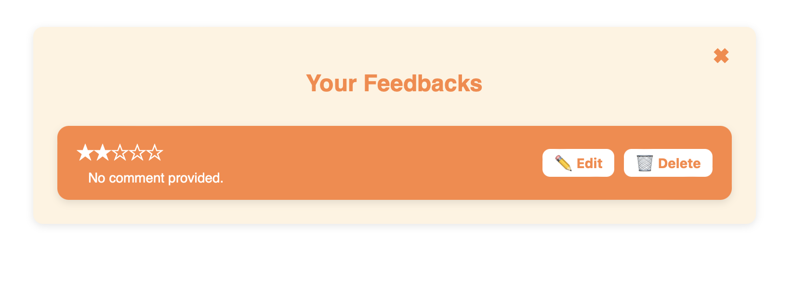
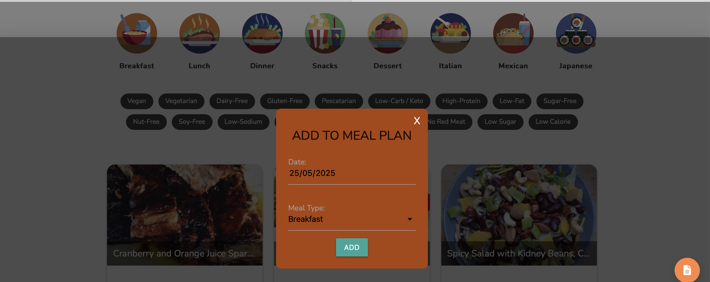
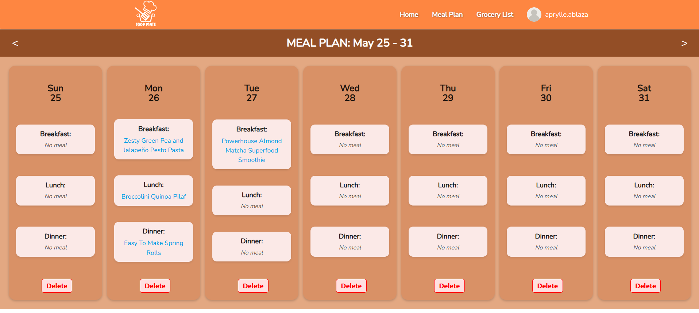

# foodmate
**Foodmate** is a meal planning and recipe browsing web app that helps users discover recipes based on their preferences, dietary needs, and available ingredients. Built with Node.js, MongoDB, and Materialize CSS, it supports JWT authentication and third-party API integration (Spoonacular, Google Gemini).

## Features

- Secure User Authentication with Email Verification and Password Reset Support
- Recipe Search with Keyword Matching
- Recipe Filtering based on Category, Dietary & Allergen Preferences
- Personalized Weekly Meal Planning 
- Grocery List Generation from Selected Meals
- Collaborative Grocery List Editing with Real-Time Updates
- AI-Powered Real-Time Chat for Meal Recommendations (via Google Gemini & Socket.io)
- Customizable User Profile with Dietary Preferences and Account Management
- Optimized API Usage through Database Caching Mechanisms
- Modern Responsive UI built with Materialize CSS
- Third-Party Integrations: Spoonacular (Recipes), Google Gemini (AI Chat)

## Tech Stack

- **Backend**: Node.js, Express.js  
- **Frontend**: EJS templates, Materialize CSS  
- **Database**: MongoDB  
- **Authentication**: JWT, Email verification  
- **Logging**: Winston – centralized logging for debugging and error tracking

- **API Integrations**:  
  - **Spoonacular** – for recipe data  
  - **Google Gemini** – AI-powered meal chat responses (via Socket.io)  
  - **Mailtrap** – for email testing and verification  

- **Real-time Communication**:  
  - **Socket.io** – enables live chat interactions with the AI

## RESTful API Endpoints

### Auth Routes (`/auth`)

| Method | Endpoint     | Description                          | Auth Required |
|--------|--------------|--------------------------------------|---------------|
| POST   | `/login`     | Logs in a user and returns a token   | ❌            |
| GET    | `/logout`    | Logs out user, clears token cookie   | ✅            |
| GET    | `/verify`    | Verifies user email                  | ❌            |
| GET    | `/register`  | Renders registration page            | ❌            |
| POST   | `/register`  | Registers a new user                 | ❌            |

### Recipe Routes (`/recipe`)

| Method | Endpoint     | Description                            | Auth Required |
|--------|--------------|----------------------------------------|---------------|
| GET    | `/search`    | Searches for recipes (filtered)        | ✅            |
| GET    | `/`          | Returns saved or suggested recipes     | ✅            |
| GET    | `/:id`       | Returns recipe details based on ID     | ✅            |

### Meal Plan Routes (`/mealPlan`)
| Method | Endpoint| Description                              | Auth Required |
|--------|---------|------------------------------------------|---------------|
| POST   | `/`     | Creates a new meal plan entry            | ✅            |
| GET    | `/week` | Returns weekly meal plan data (JSON)     | ✅            |
| GET    | `/api`  | Returns meal plan entries                | ✅            |
| DELETE | `/`     | Deletes meal entries for a specific date | ✅            |


### Grocery List Routes (`/groceryList`)

| Method | Endpoint             |Description                              | Auth Required |
|--------|--------------------- |-----------------------------------------|---------------|
| POST   | `/generate`          | Creates a new grocery list              | ✅           |
| GET    | `/:id`               | Retrieves a grocery list by ID          | ✅           |
| PATCH  | `/:id`               | Edits an existing grocery list          | ✅           |
| POST   | `/:id/collaborators` | Invites a collaborator to the list      | ✅           |
| GET    | `/all`               | Retrieves all grocery lists for a user  | ✅           |


### User Profile Update (`/profile`)
| Method | Endpoint             | Description                              | Auth Required |
|--------|----------------------|------------------------------------------|---------------|
| GET    | `/`          | Retrieves the user's profile             | ✅            |
| POST   | `/update`    | Updates the user's profile information   | ✅            |
| POST   | `/dietpreferences` | Updates dietary preferences        | ✅            |
| DELETE | `/delete`    | Deletes the user's account               | ✅            |
| POST   | `/uploadpicture` | Uploads a new profile picture       | ✅            |
| POST   | `/updateemail` | Updates the user's email address      | ✅            |

### Password Recovery 
| Method | Endpoint                 | Description                                       | Auth Required |
| ------ | ------------------------ | ------------------------------------------------- | ------------- |
| GET    | `/forgot-password`       | Renders the forgot password form                  | ❌             |
| POST   | `/forgot-password`       | Sends a reset password link to the user's email   | ❌             |
| GET    | `/reset-password/:token` | Renders the reset password form with token        | ❌             |
| POST   | `/reset-password/:token` | Updates the user's password using the reset token | ❌             |


##  Socket Events

| Event Name   | Direction | Description                                                 |
|--------------|-----------|-------------------------------------------------------------|
| `ai-message` | Client → Server | Sent by the client when a user submits a chat message to the AI |
| `ai-reply`   | Server → Client | Emitted by the server with the AI's response (from Gemini)         |
| `joinGroceryRoom`  | Client → Server  | Sent when a user joins a grocery list room to receive real-time updates.    |
| `leaveGroceryRoom` | Client → Server  | Sent when a user leaves a grocery list room to stop receiving updates.      |
| `logMessage`       | Server → Client  | Emitted when a new log entry is added to a grocery list. Sent to all clients in that room. |

## Running Locally

1. Clone the repository  
   ```bash
   git clone https://github.com/apriilbee/foodmate.git
   cd foodmate
   ```

2. Install dependencies
    ```
    npm install
    ```
3. Setup `.env` file. Replace with actual values. 
    ```
    # Spoonacular API Key
    SPOONACULAR_KEY=your-api-key

    # MongoDB Connection URI (e.g., mongodb+srv://...)
    MONGO_URI=mongodb://localhost:27017/foodmate

    # JWT Secrets
    JWT_SECRET=your-jwt-secret
    JWT_REFRESH_SECRET=your-jwt-refresh-secret

    # Gemini AI API Key
    GEMINI_API_KEY=your-gemini-api-key

    # Base URL of the application (for cookies, redirects, etc.)
    BASE_URL=http://localhost:3000

    # Mailtrap SMTP Config (for email testing in development)
    MAILTRAP_HOST=sandbox.smtp.mailtrap.io
    MAILTRAP_PORT=2525
    MAILTRAP_USER=your-mailtrap-username
    MAILTRAP_PASS=your-mailtrap-password
    ```
4.  Run the app.
    If you're actively developing: 
    ```
    npm run dev 
    ```
    
    If you're running app in production mode: 
    ```
    npm start 
    ```

## Screenshots
<div style="display: flex; flex-wrap: nowrap; overflow-x: auto; gap: 10px; padding: 10px 0;">
  <a href="./public/img/read-me/login.png" target="_blank">
    
  </a>
  <a href="./public/img/read-me/register.png" target="_blank">
    
  </a>
  <a href="./public/img/read-me/filtering.png" target="_blank">
    
  </a>
  <a href="./public/img/read-me/filtering-2.png" target="_blank">
    
  </a>
  <a href="./public/img/read-me/search.png" target="_blank">
    
  </a>
  <a href="./public/img/read-me/chatbot2.png" target="_blank">
    
  </a>
  <a href="./public/img/read-me/chatbot.png" target="_blank">
    
  </a>
  <a href="./public/img/read-me/forgetpass.png" target="_blank">
    
  </a>
  <a href="./public/img/read-me/resetpage.png" target="_blank">
    
  </a>
  <a href="./public/img/read-me/profile-picture.png" target="_blank">
    
  </a>
  <a href="./public/img/read-me/dieterypreference.png" target="_blank">
    
  </a>
  <a href="./public/img/read-me/change-password.png" target="_blank">
    
  </a>
  <a href="./public/img/read-me/change-email.png" target="_blank">
    
  </a>
  <a href="./public/img/read-me/delete-account.png" target="_blank">
    
  </a>
  <a href="./public/img/read-me/feedback-form.png" target="_blank">
    
  </a>
  <a href="./public/img/read-me/grocery-list.png" target="_blank">
    
  </a>
  <a href="./public/img/read-me/grocery-list2.png" target="_blank">
    
  </a>
  <a href="./public/img/read-me/grocery-list-history.png" target="_blank">
    
  </a>
  <a href="./public/img/read-me/feedback-management.png" target="_blank">
    
  </a>
  <a href="./public/img/read-me/mealplan-modal.png" target="_blank">
    
  </a>
  <a href="./public/img/read-me/mealplan-management.png" target="_blank">
    
  </a>
</div>
